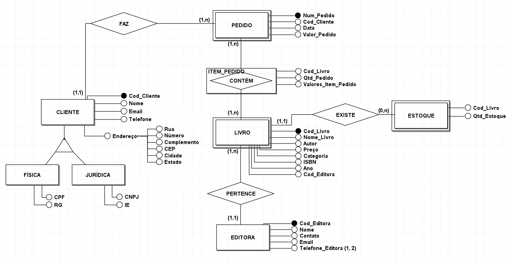

# Curso de Modelagem de Banco de Dados Relacional

## Anotações das aulas
- Aula 01: [Sistema de Gerenciamento de Banco de Dados (SGBD)](https://maze-expert-ccc.notion.site/01-SGBD-33aa365db1db495c865d32d5fb077bb1)
- Aula 02: [Entidades e Atributos](https://maze-expert-ccc.notion.site/02-Entidades-b294d2c7645a47978560a667eef4f1a5)
- Aula 03: [Relacionamentos e cardinalidade](https://maze-expert-ccc.notion.site/03-Relacionamentos-f611b053ab0040aeb1401edb73e09b1d)
- Aula 04: [Nomenclatura e conceitos de herança](https://maze-expert-ccc.notion.site/04-Nomenclatura-40bc55f08e2948898b85328b5658c096)
- Aula 05: [Estudo de caso](https://maze-expert-ccc.notion.site/05-Estudo-de-caso-872dd53d7aeb4aefbdb988980b23f048)
- Aula 06: [Finalizando o estudo de caso](https://maze-expert-ccc.notion.site/06-Finalizando-o-estudo-de-caso-ac7831ca83484f46870721d70d4c04fe)

## Resultado
Abaixo um print do diagrama completo:

